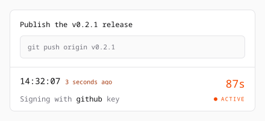

# agent-witness

[](https://github.com/evanpurkhiser/agent-witness/actions/workflows/build.yml)

A remote SSH agent for headless agents, with signing on your phone.

## Why would I need this?

You can direct an agent running on a server from your phone, but it still needs
to authenticate as you when it pushes code or connects to another machine.
agent-witness lets it use your SSH keys while keeping the private keys on your
phone, physically separate from the agent. When a request needs your attention, a push notification brings you to
an app where you can see why the agent is asking, review the command, and
authorize signing with your passkey.

The daemon runs alongside your agents and exposes a standard `SSH_AUTH_SOCK`.
Your phone holds the keys in a local vault, wrapped using the Web Crypto API.
Signing happens on the phone; the daemon receives the signature.

## See what you're authorizing

<picture>
  <source media="(prefers-color-scheme: dark)" srcset="docs/images/request-context-dark.svg">
  
</picture>

A signing request can include a reason such as "Push the release", the command
and its arguments, and a group ID that ties related requests together. The app
shows this context alongside the key being used and the time left to authorize.
You can follow one operation even when it produces several signing requests.

Context comes from the calling process through an SSH-agent protocol extension.
It describes the caller's intent; it isn't independently verified against the
bytes being signed. Your agent wrapper supplies it using
[`write-context`](#writing-request-context).

## Keys stay on your device

You import SSH private keys into the app on your phone. The app wraps them
locally and stores the encrypted blobs in IndexedDB. Neither the private keys
nor the encrypted vault are sent to the daemon.

The vault uses the browser's Web Crypto API for key wrapping and signing:

- Each SSH private key is wrapped with an AES-256-GCM master key.
- A WebAuthn passkey's PRF output derives a wrapping key through HKDF-SHA256.
  That key wraps the vault's master key.
- On unlock, the master key and signing keys are unwrapped as non-extractable
  `CryptoKey` objects. Web Crypto uses them without exposing their raw bytes
  through its export API.

The browser and passkey provider must support the WebAuthn PRF extension.
Imported keys must be passphrase-free OpenSSH private keys. Supported types are
Ed25519, RSA with SHA-256 or SHA-512 signatures, and ECDSA P-256.

## Setup

### Build

Install the pinned toolchain and JavaScript dependencies, then build the
frontend and release server:

```console
mise install
pnpm install --frozen-lockfile
pnpm build:production
```

The resulting `target/release/agent-witness` binary embeds the web app and can
run without `packages/app/dist`.

### Run the daemon

The Arch package installs `agent-witness.service`, which reads
`/etc/agent-witness.toml`. A configuration with persistent pairing looks like:

```toml
http_listen = "127.0.0.1:9345"
unix_socket = "/run/agent-witness/agent.sock"
socket_mode = "0600"
state_path = "/var/lib/agent-witness/state.json"
control_socket = "/run/agent-witness/control.sock"
control_socket_mode = "0600"
vapid_private_key_file = "/var/lib/agent-witness/vapid.key"
request_timeout = "90s"
```

Enable and start the service after configuring it. Systemd creates
`/run/agent-witness` and `/var/lib/agent-witness` with root-only access. To let
another local user connect, use a systemd drop-in to grant a group access to the
runtime directory and set `socket_mode` to allow that group to use the agent
socket. Keep the administrative control socket restricted.

You can also run the binary directly with `agent-witness --config <path> serve`.
Choose socket and state paths writable by the user running it.

Put an HTTPS reverse proxy in front of the HTTP listener, with WebSocket
support, and use a URL your phone can reach. The app needs a secure browser
context for WebAuthn. The first client to connect claims the daemon's single
pairing slot, so keep access restricted while pairing your device.

### Connect your phone and agents

Open the app's HTTPS URL on your phone, add it to the Home Screen, and launch it
from there. Create a vault with your passkey, import your SSH keys, and enable
push notifications.

Point processes on the server at the daemon's socket:

```sh
export SSH_AUTH_SOCK=/run/agent-witness/agent.sock
```

SSH clients and other tools that use the SSH-agent protocol can then request
signatures from your phone. Add context support to your agent wrapper so those
requests include the reason and command you want to review.

### Writing request context

Write a binary, length-prefixed SSH-agent context packet to stdout:

```console
agent-witness write-context --reason "Push the release" \
  --groupId d371fa50458a41918893d00139c781a2 -- git push origin main > context.packet
```

The reason and argv after `--` are required. The command is metadata only;
`write-context` does not execute it. Omitting `--groupId` generates a UUID.
Reuse a group UUID across connections belonging to the same operation. Group
UUIDs use 32 hexadecimal characters on the wire.

A wrapper writes this packet as the first message on an SSH-agent connection,
consumes the acknowledgement, and then relays agent traffic over that same
connection. Context applies to all signing requests on the connection.

### Pairing state

Set `state_path` to retain the server identity and paired client across
restarts. Without it, pairing lasts for the daemon process's lifetime.

The daemon atomically replaces the state file with mode `0600`. It stores the
client credential as a hash, along with pairing metadata, public identities,
and the push subscription. The VAPID key used to send push notifications is
stored separately at `vapid_private_key_file`.

To clear the current pairing and revoke its active connection:

```console
agent-witness pairing clear
```

Pass `--config <path>` if the daemon uses a custom control socket configured in
that file. Clearing pairing frees the slot for another client.

### Sentry

Configure separate Sentry projects for the daemon and browser application:

```toml
sentry_backend_dsn = "https://public@example.ingest.sentry.io/1"
sentry_frontend_dsn = "https://public@example.ingest.sentry.io/2"
```

The server embeds the public frontend DSN in the HTML response at runtime, so
the frontend build contains no environment-specific configuration. Both SDKs
send errors, structured logs, and traces when their DSN is configured. Tracing
uses a `1.0` sample rate.

## Development

After installing the toolchain and dependencies, run the app and an isolated
development daemon:

```console
pnpm dev
```

The daemon listens on `127.0.0.1:19345`, while Vite listens on
`127.0.0.1:5173`. Use an HTTPS reverse proxy to open the Vite server on your
phone, add it to the Home Screen, and launch it from there.

Development pairing state and the VAPID key persist in the ignored `.dev`
directory. The agent socket is `.dev/agent.sock`. Press Ctrl-C to stop both
processes.

## Versioning

The Cargo workspace version is shared by the server and both JavaScript package
manifests. To bump it, run the Bump workflow on `main` with a semantic
version:

```console
gh workflow run bump.yml --ref main -f version=0.2.0
```

The workflow requires passing lint, tests, and Docker build checks for its base
commit. It updates the manifests and Cargo lockfile, then pushes a release commit
and matching `vX.Y.Z` tag together. If `main` advances during the workflow, rerun
it against the new commit.

After pushing the tag, Bump dispatches the Release workflow. Release verifies the
tag against the Cargo workspace version and triggers the agent-witness package
build in `evanpurkhiser/PKGBUILDs`. It also accepts version-tag pushes and manual
dispatches on a version tag.

The repository secret `AUR_BUMP_DISPATCH_PAT` must contain a token with
`actions:write` and `contents:read` access to `evanpurkhiser/PKGBUILDs`.
